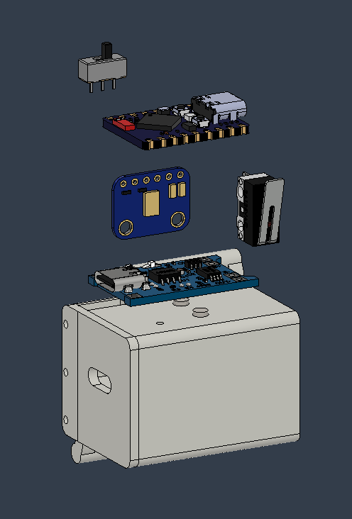

# Joint&Waves: Wearable Acoustic Joint Diagnosis System

**Design and Development of a Wearable System for Diagnosing Joint Conditions via Acoustic Analysis of Movement-Induced Sounds**

.png)

## 📖 Overview
Knee osteoarthritis (OA) affects over 365 million people worldwide. While gold-standard diagnostics like X-rays and MRIs are highly accurate, they are costly, expose patients to radiation, and are unsuitable for continuous monitoring. 

**Joint&Waves** addresses this gap by utilizing **Vibroarthrography (VAG)**. Our low-cost, non-invasive wearable device captures the acoustic emissions and friction sounds generated by joint cartilage during movement. By analyzing these acoustic signatures using Edge AI directly on the device, the system can classify joint health (Normal vs. Abnormal/Crepitus) in real-time, providing an objective, quantitative metric for continuous monitoring.

## 🛠️ System Architecture

### 1. Hardware Module
The wearable node is designed with ergonomics and mobility in mind, featuring a custom 3D-printed enclosure and a soft elastic band to secure the sensor directly over the joint (knee or elbow).
* **Microcontroller:** ESP32-S3 Super Mini. Chosen for its ultra-compact footprint, Dual-core 240MHz processor, and native support for AI vector instructions.
* **Acoustic Sensor:** SPH0645 MEMS Microphone. 
* **Data Protocol:** Inter-IC Sound (I2S). The digital I2S interface completely eliminates the analog transmission noise commonly found in older piezoelectric or electret microphone setups.

### 2. Signal Processing & Edge AI Pipeline (On-Device)
To optimize power consumption and guarantee patient privacy, all critical data processing occurs locally on the ESP32-S3.
* **Data Acquisition & Filtering:** The raw acoustic signals are captured and passed through a Butterworth bandpass filter (100–1000 Hz) to isolate joint emissions from ambient environmental noise.
* **Feature Extraction:** The microcontroller computes key acoustic features in real-time, including:
  * Mean Frequency
  * Zero Crossing Rate
  * Peak Frequency
  * RMS Amplitude
  * Spectral Entropy
* **Classification Model:** A lightweight **Random Forest** algorithm is embedded directly into the C++ firmware. Trained initially using Scikit-learn, this model evaluates the extracted features and outputs a diagnosis with ultra-low latency.

### 3. PC Monitoring Software
A robust desktop application allows medical professionals to visualize and manage patient data. 
* **Framework:** Built with Python and **PyQt6** for a modern, fluid user interface.
* **Analysis Tools:** Utilizes NumPy and SciPy to render real-time waveforms, Fast Fourier Transform (FFT), and spectrograms.
* **Data Management:** Features SQLite/CSV database integration to securely store patient records and historical diagnostic data.
* **Connectivity:** Receives diagnostic results and telemetry from the wearable device via Bluetooth Low Energy (BLE) and Serial communication.

## 🚀 Future Roadmap
* **Mobile Application:** Development of a companion mobile app (via Flutter or MIT App Inventor) to allow patients to independently track their joint health at home via BLE.
* **Dual-Channel Expansion:** Enabling simultaneous acoustic acquisition from two independent channels for spatial noise cancellation and multi-point joint analysis.
* **Electronic Health Record (EHR) Integration:** Creating standardized APIs to sync device telemetry with broader hospital databases.

## 📁 Repository Structure
* `/hardware`: Electrical schematics, component lists, and 3D files for the ergonomic case.
* `/firmware`: ESP32-S3 C++ source code containing the I2S drivers, DSP filtering algorithms, and the embedded Random Forest logic.
* `/software`: PyQt6 desktop application source code for real-time visualization and database management.
* `/model`: Scikit-learn training scripts, dataset processing tools, and the scripts used to convert the model to C++ headers.
* `/docs`: Project presentation posters, performance graphs, and other documents.

## 🤝 Authors & Acknowledgements
* **Project Lead:** Nguyen Tan Tri 
* **Team Member:** Ta Hoang Truc Tho 
* **Advisor:** Assoc. Prof. Le Ngoc Bich 

Special thanks to our seniors, Nguyen Nhat Minh and Ta Minh Tri, for their invaluable guidance during the research and development phases of this device.
